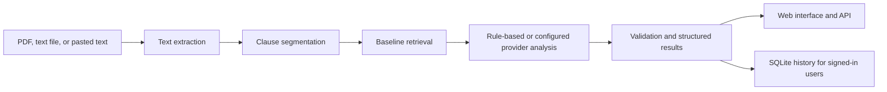

# ClauseClear

ClauseClear is a web application for reviewing lease and consumer-loan agreements. It extracts and segments contract text, compares clauses with a curated baseline library, and presents potential risks with plain-language explanations.

> ClauseClear is an informational tool, not a substitute for advice from a qualified legal professional. Its classifications are heuristic and may not reflect the laws or requirements of a particular jurisdiction.

## Features

- Extract text from PDF, TXT, and Markdown files; accept pasted contract text.
- Segment documents using legal headings, numbering, and paragraph boundaries.
- Compare clauses with a local library of standard provisions using ChromaDB, with a TF-IDF retrieval fallback.
- Produce clause categories, risk scores, explanations, deviations, and suggested questions.
- Use local rule-based analysis or configure Groq and Gemini providers.
- Provide account sign-in, saved analysis history, sample agreements, and an evaluation view.

Scanned image OCR is optional. It requires both `pytesseract` and a Tesseract installation; these are not included in `requirements.txt`. Scanned PDFs may not contain extractable text without an OCR step.

## Processing Overview



## Technology

- Python and FastAPI for the API and application server
- Vanilla JavaScript, Tailwind CSS, and Lucide icons for the frontend
- ChromaDB for persistent clause retrieval, with scikit-learn TF-IDF fallback
- SQLite for user accounts and saved analysis history
- PyMuPDF for extracting text from PDF files

## Requirements

- Python 3.10 or newer
- Windows, macOS, or Linux
- Optional: a Groq or Gemini API key for provider-backed analysis
- Optional for image OCR: Tesseract and the `pytesseract` Python package

## Installation and Run

Run these commands from the project root.

Create and activate a virtual environment:

```powershell
python -m venv .venv
.\.venv\Scripts\Activate.ps1
```

On macOS or Linux, activate it with:

```bash
source .venv/bin/activate
```

Install dependencies and start the server:

```bash
python -m pip install --upgrade pip
python -m pip install -r requirements.txt
python -m backend.app
```

Open `http://127.0.0.1:8000`. FastAPI's interactive API documentation is available at `http://127.0.0.1:8000/docs`.

## Configuration

Provider keys can be set in a `.env` file in the project root or in the process environment. For example:

```dotenv
GROQ_API_KEY=your_groq_api_key
GEMINI_API_KEY=your_gemini_api_key
DEFAULT_PROVIDER=groq
HOST=127.0.0.1
PORT=8000
```

Without a usable provider key, the application uses its local analysis path. When a cloud provider is active, contract text is sent to that provider for analysis. Review the provider's data-handling terms before submitting sensitive documents.

Set `JWT_SECRET_KEY` directly in the process environment before starting the application when using accounts beyond local development. Do not rely on the development default or commit secrets to source control.

## Production Deployment

Set `ENVIRONMENT=production` and provide `JWT_SECRET_KEY` with at least 32 characters through the hosting provider's secret manager. The application refuses to start without it. Set `DEBUG=false`; configure `HOST=0.0.0.0` and the platform-provided `PORT`. If the frontend is hosted on a different origin, set `CORS_ORIGINS` to a comma-separated list of exact HTTPS origins. Same-origin hosting does not need CORS entries.

Set provider API keys through the hosting provider's secret manager. Demo login and browser-based provider-key updates are disabled outside development. When cloud analysis is used, contract text is sent to the configured AI provider. Signed-in analyses, including clause text, are saved in the user's account history until deleted.

The current account and history database is SQLite. Production hosting must provide persistent storage for both `backend/data/` and `chroma_db/`, and should run a single application instance. Do not scale this configuration across replicas; move account/history data to a managed database and the vector store to shared storage before scaling. Terminate HTTPS at the hosting platform's trusted reverse proxy.

Request bodies are limited to 10 MiB by default; adjust `MAX_REQUEST_BYTES` to match the hosting platform's request limit. Login and analysis are limited per client IP, and registration and evaluation have stricter hourly limits. The default rate-limit store is in-memory and is suitable only for a single worker. Configure `RATE_LIMIT_STORAGE_URI` with a managed Redis URL before running multiple workers or instances, and configure the server to trust only the hosting platform's proxy headers so client IP-based limits cannot be spoofed.

## API

The full request and response schemas are available from `/docs`. The main route groups are:

- **Analysis:** `POST /api/analyze/file`, `POST /api/analyze/text`
- **Configuration:** `GET /api/config`, `POST /api/config/key`, `POST /api/config/groq-key`
- **Knowledge base:** `GET /api/kb/clauses` (optional `category` query parameter)
- **Evaluation:** `POST /api/eval/run`
- **Samples:** `GET /api/samples`, `GET /api/samples/{sample_id}`
- **Authentication:** `POST /api/auth/register`, `POST /api/auth/login`, `POST /api/auth/demo-login`, `GET /api/auth/me`, `POST /api/auth/logout`
- **Analysis history:** `GET` and `POST /api/user/history`, `GET` and `DELETE /api/user/history/{history_id}`

Analysis and history routes require authentication. The API returns a bearer token from the sign-in and registration endpoints.

## Tests and Evaluation

Run the unit tests with:

```bash
python -m unittest discover -s tests
```

Run the labeled evaluation suite with:

```bash
python -m backend.evaluation.eval_pipeline
```

The evaluation suite contains 20 labeled clauses and reports precision, recall, F1, accuracy, risk-level accuracy, and category accuracy. Results depend on the configured provider and current implementation; they should not be treated as evidence of legal accuracy or performance on documents outside this test set.

## Data and Limitations

- Signed-in users' saved analyses are stored in the application's SQLite database under `backend/data/`.
- Provider-backed analysis may transmit clause text to Groq or Gemini, depending on configuration.
- Risk scores and suggested questions are generated from heuristics, retrieved examples, and configured models; review important findings with a qualified professional.
- Baseline provisions are general references and are not jurisdiction-specific legal standards.
